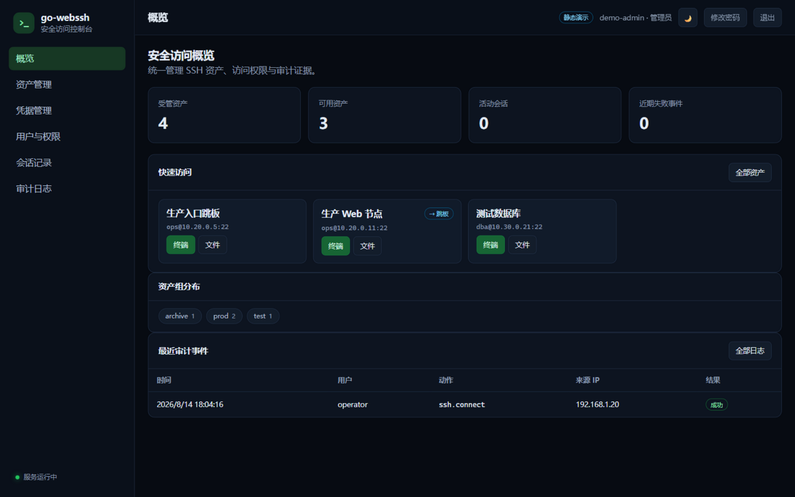
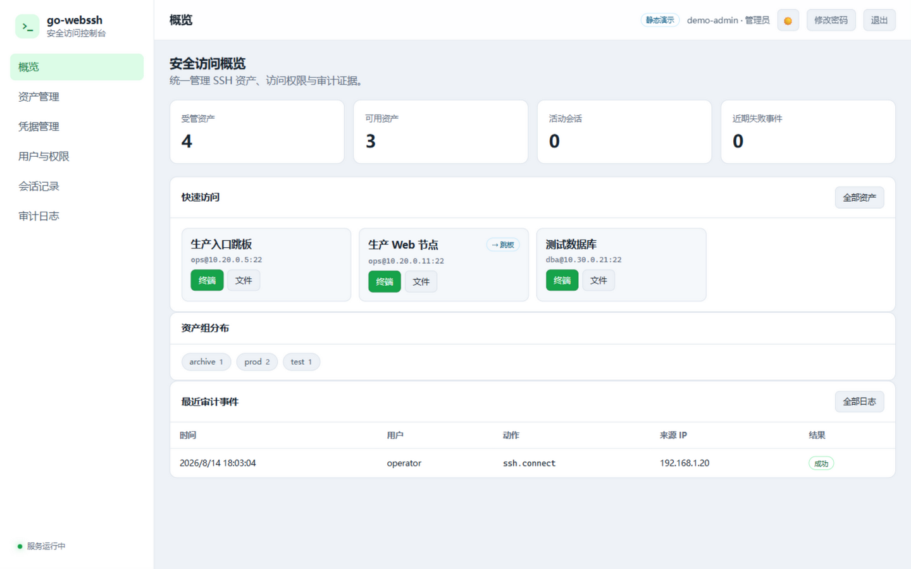
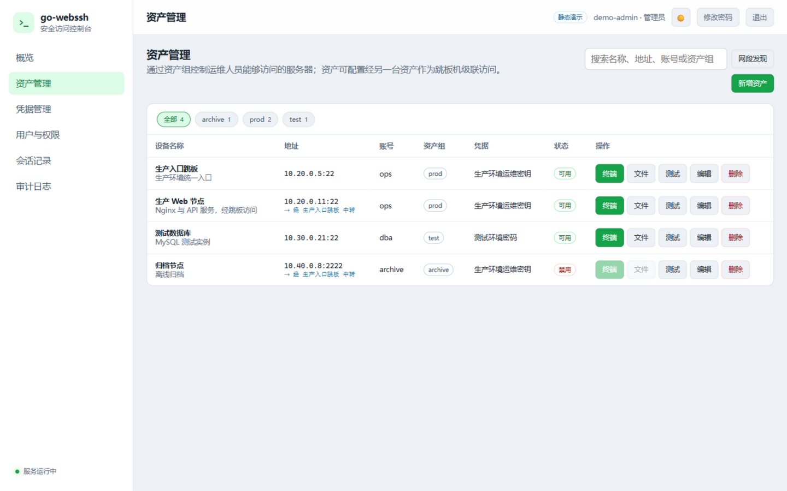
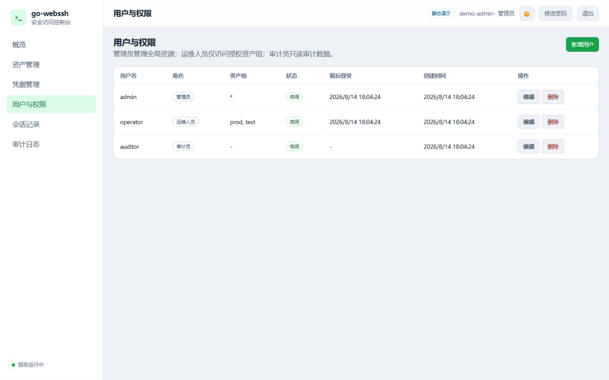
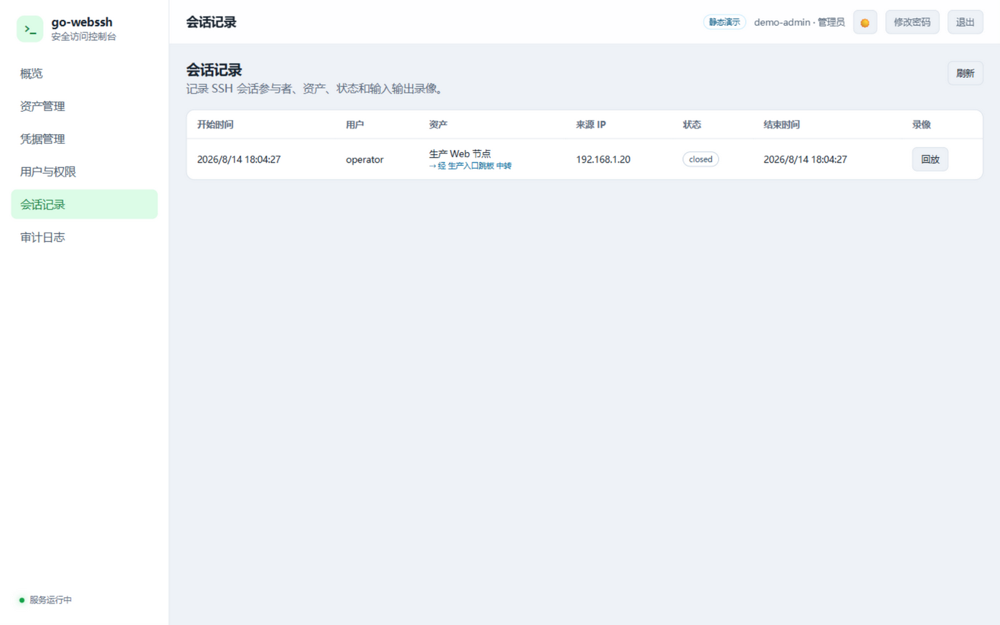

[简体中文](README.md) | [English](README.en.md)

# go-webssh

A lightweight Web SSH bastion: a Go server bridges the browser's WebSocket to SSH sessions on target hosts, the browser renders the terminal with xterm.js, and all frontend assets are embedded into a single executable.

[](https://go.dev/)
[](LICENSE)
[](https://github.com/hequan2017/go-webssh/actions/workflows/pages.yml)

The [online demo](https://hequan2017.github.io/go-webssh/) is a read-only static console. It does not connect to SSH and never collects credentials.

## Introduction

go-webssh targets single-node operations scenarios for individuals and small teams. It solves the problem of "bringing SSH into the browser": instead of configuring keys and jump rules on every machine, you log into one web console and connect to the servers you are authorized to use. Authentication, RBAC, SSH/SFTP proxying, credential encryption, audit logging, and terminal session recording are built in and work out of the box.

Compared with enterprise bastion hosts, it deliberately stays simple: single-node deployment, file-based persistence, zero external dependencies (no database or message queue required). One binary plus one data directory is all it takes. It suits ops and developer teams managing a few dozen servers who still want role-based access and audit trails.

If you need an enterprise-grade bastion (clustering, SSO, MFA, high availability), choose a dedicated product. go-webssh aims to be a lightweight, readable, and easy-to-extend bastion implementation.

## ✨ Features

**Authentication and users**

- Local account login with HttpOnly/SameSite session cookies and login rate limiting
- Three roles: administrator (`admin`), operator, and auditor
- User lifecycle management: onboarding with random initial passwords, last-login tracking, deleting users and revoking their sessions immediately
- Self-service password change; all old login sessions are invalidated afterwards

**Assets and authorization**

- Multi-server asset management with enable/disable, and server access authorization based on asset groups
- Asset SSH handshake and authentication connectivity tests (no remote commands executed)
- Network discovery: concurrently probe a CIDR for devices with open SSH ports and import them as assets in one click
- Password, plain private key, and passphrase-protected private key login; password auth falls back to keyboard-interactive automatically (compatible with switches and similar devices)
- Bastion chaining (ProxyJump): an asset can route through another asset, up to 5 hops, shared by terminal and file transfer
- AES-256-GCM credential encryption; the API never returns plaintext
- Optional SSH `SHA256:` host key fingerprint verification

**Terminal and file transfer**

- Interactive browser terminal (showing the full jump path), window resizing, heartbeat keep-alive, reconnect, clear screen, and fullscreen
- Light/dark theme toggle that follows the system preference and persists
- SFTP directory browsing, file upload and download, directory creation, rename, and delete; uploads never overwrite existing files by default

**Audit and operations**

- Auditing of logins, configuration changes, SSH commands, sessions, and file transfers (including the jump path)
- Online playback and download of SSH input/output session recordings
- Administrators can view and force-disconnect active SSH sessions
- Docker runs as non-root, with health checks and data volumes
- Pushing to `main` triggers GitHub Actions to test, build, and publish the Pages demo automatically

## 🛠 Tech Stack

| Layer | Choice |
| --- | --- |
| Backend | Go 1.24.9, [gorilla/websocket](https://github.com/gorilla/websocket) v1.5.1, [golang.org/x/crypto](https://pkg.go.dev/golang.org/x/crypto/ssh) (SSH), [pkg/sftp](https://github.com/pkg/sftp) v1.13.7 |
| Frontend | Vanilla JavaScript + [xterm.js](https://xtermjs.org/) (local static assets, embedded via `go:embed`, no frontend build step) |
| Deployment | Multi-stage Docker build (alpine 3.22, non-root UID 65532), docker compose, GitHub Actions |

## 🚀 Getting Started

### Run locally

The first startup requires an administrator password of at least 12 characters:

```powershell
$env:BASTION_ADMIN_PASSWORD = "replace-with-a-strong-password"
go run .
```

Open <http://127.0.0.1:8080> and sign in as user `admin` with the password you set. The first startup creates:

```text
data/
├── master.key       # auto-generated credential master key
├── state.json       # users, assets, encrypted credentials, session index
├── audit.jsonl      # append-only audit log
└── recordings/      # SSH input/output recordings
```

`data/` is Git-ignored. Never commit any file inside it.

### Docker

```powershell
docker build -t go-webssh-bastion .
docker run --rm -p 8080:8080 `
  -e BASTION_ADMIN_PASSWORD=replace-with-a-strong-password `
  -v go-webssh-data:/data `
  go-webssh-bastion
```

The container runs as UID/GID `65532` with the state directory fixed at `/data`.

### docker compose

```powershell
Copy-Item ".env.example" ".env"
# Edit the administrator password in .env
docker compose up -d --build
```

Compose enables a read-only root filesystem, drops all Linux capabilities, blocks privilege escalation, and stores persistent data in the named volume `bastion-data`. `.env` is Git-ignored; `.env.example` contains placeholders only.

### Environment variables

| Variable | Description | Default |
| --- | --- | --- |
| `LISTEN_ADDR` | HTTP listen address | `:8080` |
| `BASTION_DATA_DIR` | Directory for state, master key, audit log, and recordings | `data` |
| `BASTION_ADMIN_USER` | Administrator username created on first startup | `admin` |
| `BASTION_ADMIN_PASSWORD` | Administrator password on first startup, at least 12 characters | none |
| `BASTION_MASTER_KEY` | Base64-encoded 32-byte master key; auto-generated file if unset | none |
| `BASTION_SESSION_HOURS` | Web login session validity in hours | `12` |
| `BASTION_MAX_UPLOAD_MB` | Per-file upload limit | `100` |

After the administrator is created, later startups no longer read `BASTION_ADMIN_PASSWORD` to change the password. Change user passwords in the console.

Example of generating an external master key:

```powershell
$bytes = New-Object byte[] 32
[System.Security.Cryptography.RandomNumberGenerator]::Fill($bytes)
[Convert]::ToBase64String($bytes)
```

## 📁 Project Layout

```text
go-webssh/
├── main.go               # entry point, embeds static assets and starts the HTTP server
├── core/                 # auth, SSH/SFTP, network discovery, audit, recording, etc.
├── web/html/             # single-page console
├── static/               # CSS/JS (incl. xterm.js) and demo screenshots
├── Dockerfile            # multi-stage build, runs as non-root
├── compose.yaml          # hardened docker compose configuration
└── .github/workflows/    # test, build, and Pages publishing pipeline
```

## 📸 Screenshots

| Overview (dark) | Overview (light) |
| --- | --- |
|  |  |

| Asset management | Users and permissions |
| --- | --- |
|  |  |



## 🔑 Permission Model

| Role | Permissions |
| --- | --- |
| `admin` | Manage users, credentials, and assets; access all assets; view audit logs and recordings |
| `operator` | Access only the asset groups they are granted; use terminal and SFTP |
| `auditor` | Read-only view of assets, audit logs, sessions, and recordings; cannot open SSH/SFTP sessions |

Operator asset groups accept exact names such as `prod,test`; use `*` for all asset groups.

## 🖥 Assets, Credentials, and Jump Chaining

1. Create password or SSH private key credentials under "Credential Management" as an administrator.
2. Under "Asset Management", fill in the host, port, SSH user, and asset group and attach a credential; or use "Network Discovery" to scan a CIDR such as `192.168.1.0/24` and import hosts in one click.
3. For devices behind NAT, pick another asset in the "Jump host" field as a relay (up to 5 hops); the terminal, file transfer, and connectivity tests all log into the jump host first and then forward.
4. It is recommended to store the target server's `SHA256:` host key fingerprint (the jump host and the target are verified independently).
5. Configure the asset groups each operator may access; every hop in the connection chain requires permission on its asset group.

Example of obtaining an OpenSSH host key fingerprint:

```powershell
ssh-keyscan example.com | ssh-keygen -lf - -E sha256
```

Without a host key fingerprint configured, legacy behavior is preserved and the key offered by the target host is accepted; only use this on trusted networks.

## 📂 File Transfer

The "Files" entry in the asset list opens an independent SFTP session using the same asset credentials as the terminal:

- Browse remote directories, select and upload multiple files one by one, and download regular files
- Create directories, rename, and delete files and empty directories
- Uploads use exclusive creation and never overwrite existing remote files
- Incomplete remote files beyond `BASTION_MAX_UPLOAD_MB` are cleaned up
- Browsing, uploading, and downloading are all written to the audit log

## 📜 Audit, Recordings, and Backup

- `audit.jsonl` records authentication, user/asset/credential changes, SSH commands, and file operations; SSH and file events include the full jump path (`jump_path`).
- `recordings/*.jsonl` stores terminal input and output as Base64 frames with online playback; only admins and auditors may download recordings.
- Audit files may contain commands typed in terminals and sensitive output; treat them as sensitive data.
- Backups must include the entire `BASTION_DATA_DIR` (`master.key`, `state.json`, `audit.jsonl`, `recordings/`). With `state.json` alone and no matching master key, encrypted credentials cannot be recovered. Back up after stopping writes or freezing the volume, and restore the files to the same paths with writable permissions for the service account.

## 🔌 HTTP API

| Method | Path | Description |
| --- | --- | --- |
| `POST` | `/api/auth/login` | Log in |
| `POST` | `/api/auth/logout` | Log out |
| `GET` | `/api/me` | Current user |
| `POST` | `/api/me/password` | Change the current user's password and invalidate old sessions |
| `GET/POST/PUT/DELETE` | `/api/assets` | Asset management (including the `jump_asset_id` jump-chaining field) |
| `POST` | `/api/assets/{id}/test` | Test SSH handshake and authentication |
| `GET/POST/PUT/DELETE` | `/api/credentials` | Credential management |
| `GET/POST/PUT` | `/api/users` | User and permission management |
| `DELETE` | `/api/users/{id}` | Delete a user and revoke their sessions (the last admin cannot be deleted) |
| `POST` | `/api/discovery` | Admin network discovery: `{"cidr":"192.168.1.0/24","port":22,"timeout_ms":1500}`, returns hosts with open SSH ports and version banners |
| `GET` | `/ws/{assetID}` | SSH WebSocket for an authorized asset |
| `GET/POST` | `/api/assets/{id}/files` | SFTP list/upload |
| `PATCH/DELETE` | `/api/assets/{id}/files` | SFTP rename/delete |
| `POST` | `/api/assets/{id}/directories` | Create a remote directory |
| `GET` | `/api/assets/{id}/download` | SFTP download |
| `GET` | `/api/audits` | Audit log |
| `GET` | `/api/sessions` | Session records |
| `DELETE` | `/api/sessions/{id}` | Admin force-disconnects an active session |
| `GET` | `/api/sessions/{id}/recording` | Download a session recording |
| `GET` | `/healthz` | Health check |

## 🚢 GitHub Pages Demo

The repository ships with [`.github/workflows/pages.yml`](.github/workflows/pages.yml). Pushing to `main` automatically runs `go test ./...`, `go vet ./...`, builds the Go binary, builds a read-only static demo site, and publishes it to GitHub Pages.

For first-time use, select **GitHub Actions** under the repository's **Settings → Pages → Build and deployment → Source**.

GitHub Pages cannot run Go, SSH, or SFTP services; the Pages version only shows sample assets and the management UI.

## ⚠️ Security Boundary

- For public-facing deployments, enable HTTPS, access control, and request rate limiting behind a trusted reverse proxy.
- Configure SSH host key fingerprints to prevent man-in-the-middle attacks.
- The master key, state, audit logs, and recordings are all sensitive data; restrict file permissions and include them in secure backups.
- The current version uses single-node file persistence and does not provide cluster consistency, external SSO, MFA, or high availability; these are enterprise extensions, and a single-node deployment must not be described as HA.
- Disabling a user immediately clears their web login session, but established SSH sessions should be handled by an administrator together with session audit data.

## 🧑‍💻 Development

```powershell
go test ./...
go vet ./...
go build ./...
node --check static/js/app.js
```

## 🔗 Related Projects

- [hequan2017/husky](https://github.com/hequan2017/husky) — a beginner-friendly CMDB system built with Django (tutorial project)
- [hequan2017](https://github.com/hequan2017) — the author's other open-source projects

## 📄 License

[MIT](LICENSE)
