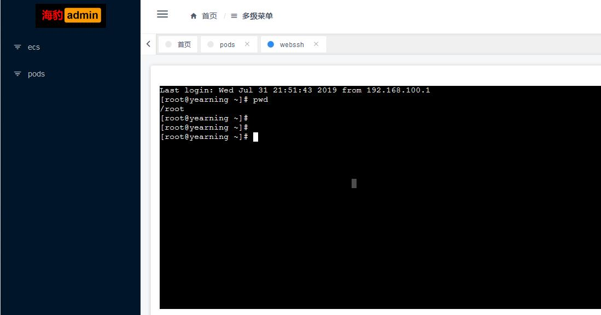

# go-webssh

基于 Go + WebSocket + xterm.js 的 Web SSH 终端，在浏览器中直接连接远程服务器。

> 本项目代码源自 [felix](https://github.com/dejavuzhou/felix)，提取 webssh 模块并优化。

## 架构

```
浏览器 (xterm.js)
   ↕  WebSocket
Gin HTTP Server (:8080)
   ↕  gorilla/websocket
core.WsSsh 处理器
   ├── ReceiveWsMsg:  浏览器 → SSH stdin
   ├── SendComboOutput: SSH stdout → 浏览器 (120ms 轮询)
   └── SessionWait:   等待 SSH 会话结束
   ↕  TCP
远程 SSH 服务器
```

## 快速开始

### 环境变量配置

| 变量名 | 说明 | 默认值 |
|--------|------|--------|
| `SSH_HOST` | SSH 服务器地址 | `127.0.0.1` |
| `SSH_PORT` | SSH 端口 | `22` |
| `SSH_USER` | 用户名 | `root` |
| `SSH_PASSWORD` | 密码（与 SSH_KEY_PATH 二选一） | 无 |
| `SSH_KEY_PATH` | 密钥文件路径（优先于密码） | 无 |
| `LISTEN_ADDR` | Web 服务监听地址 | `:8080` |

### 启动

```bash
# 设置 SSH 连接信息
export SSH_HOST=192.168.1.100
export SSH_USER=root
export SSH_PASSWORD=your_password

# 启动服务
go run main.go
```

浏览器访问 `http://localhost:8080` 即可打开终端。

### Docker 部署

```bash
docker build -t go-webssh .
docker run -d -p 8080:8080 \
  -e SSH_HOST=192.168.1.100 \
  -e SSH_USER=root \
  -e SSH_PASSWORD=your_password \
  go-webssh
```

## API

### WebSocket 终端

```
GET /ws/:id?cols=120&rows=32
```

- `:id` — 连接标识（预留参数）
- `cols` — 终端列数，默认 120
- `rows` — 终端行数，默认 32

**消息格式：**

- 终端输入：直接发送原始字节
- 终端尺寸变更：`{"type":"resize","cols":80,"rows":24}`

## 项目结构

```
├── main.go              # 入口，路由与 CORS 中间件
├── core/
│   ├── config.go        # 环境变量配置加载
│   ├── ssh.go           # SSH 客户端创建与认证
│   ├── ssh_shell_conn.go # SSH 会话管理（I/O 桥接、resize）
│   ├── h_ws_ssh.go      # WebSocket 处理器
│   └── helper.go        # 错误处理工具函数
├── web/
│   ├── html/index.html  # 内嵌终端页面
│   └── vue/             # Vue 组件（参考）
├── static/              # 前端静态资源（xterm.js、CSS）
```

## 前端集成

项目中提供两种前端方案：

1. **独立 HTML** (`web/html/index.html`) — 直接由 Gin 渲染，开箱即用
2. **Vue 组件** (`web/vue/`) — 适合集成到已有 Vue 项目中，需自行修改 WebSocket 地址

xterm.js 当前为 v3 版本，如需 v4 可参考[这篇博客](https://blog.51cto.com/hequan/3712190)。

## 示例



## License

MIT
